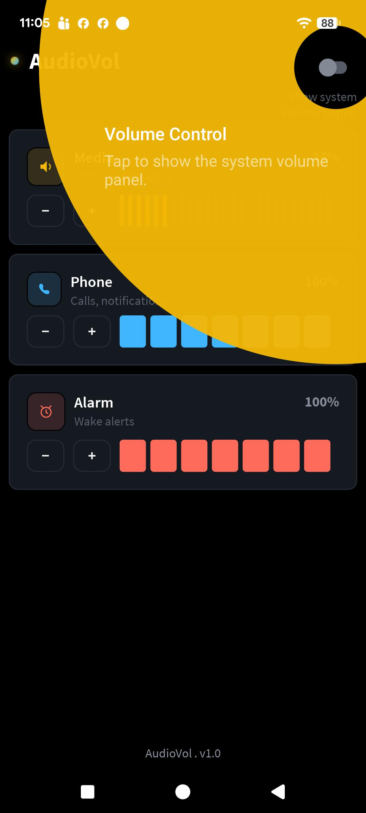
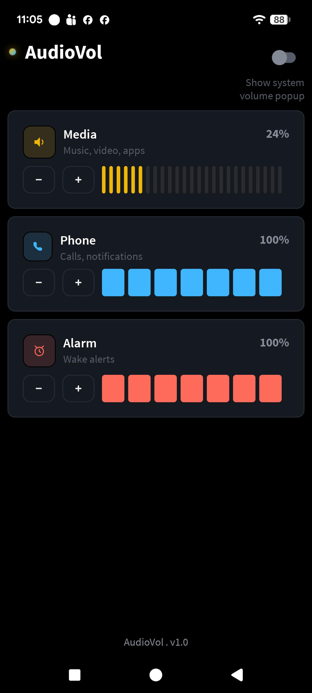

# AudioVol 🔊
 
**AudioVol** is a lightweight Android app that lets you control your phone's most important volume streams — **Media**, **Phone (Ringtone/Notifications)**, and **Alarm** — directly from a clean in-app interface, without needing to press your device's physical volume buttons.
 
## 💡 Why AudioVol?
 
If your phone's **physical volume button is broken or damaged**, you normally lose the ability to increase or decrease your volume at all. AudioVol solves this problem by giving you full on-screen control over your device's volume streams, so a broken volume button no longer means you're stuck with whatever volume level your phone happens to be at.
 
## ✨ Features
 
- 🎵 **Media Volume Control** — Adjust volume for music, videos, and apps.
- 📞 **Phone Volume Control** — Adjust volume for calls and notifications.
- ⏰ **Alarm Volume Control** — Adjust volume for wake-up alarms.
- ➕➖ **Simple +/- Controls** — Precisely increase or decrease each stream with a tap.
- 🔕 **System Volume Popup Toggle** — Enable or disable the native Android system volume UI overlay while using the app, so you get an uninterrupted, custom volume-control experience.
- 🎯 **Built-in App Tutorial** — A guided walkthrough (powered by `TapTargetView`) shows first-time users exactly how each control works.
 
## 📱 Screenshots
 
| Onboarding Tutorial | Main Screen |
|---|---|
|  |  |
 
The **Main Screen** shows the three volume categories (Media, Phone, Alarm) with live percentage indicators and quick +/- controls, plus a toggle to show/hide the system volume popup.
 
The **Tutorial Screen** uses a tap-target overlay to highlight the "Show system volume popup" toggle and explain what it does when a user opens the app for the first time.
 
## 🛠️ Tech Stack
 
- **Language:** Kotlin / Java
- **Platform:** Android (Native)
- **Onboarding UI:** [`TapTargetView`](https://github.com/KeepSafe/TapTargetView) — used to create the interactive tutorial/spotlight overlay that teaches users how to use the app.
 
### Gradle Dependency
 
```gradle
dependencies {
    implementation(libs.taptargetview)
}
```
 
Make sure the corresponding entry exists in your version catalog (`libs.versions.toml`):
 
```toml
[versions]
taptargetview = "1.14.0"
 
[libraries]
taptargetview = { group = "com.getkeepsafe.taptargetview", name = "taptargetview", version.ref = "taptargetview" }
```
 
## ⚙️ How It Works
 
AudioVol uses Android's `AudioManager` to directly read and modify the volume levels of the `STREAM_MUSIC`, `STREAM_RING`, and `STREAM_ALARM` audio streams. This allows the app to:
 
1. Display the current volume level of each stream as a percentage.
2. Increase or decrease each stream's volume independently using on-screen `+` / `−` buttons.
3. Suppress or allow the default Android system volume UI (the popup that normally appears when volume changes) based on user preference, using the appropriate `AudioManager` flags when adjusting volume.
 
## 🚀 Getting Started
 
1. Clone the repository.
2. Open the project in **Android Studio**.
3. Sync Gradle to fetch dependencies, including `TapTargetView`.
4. Add your google-service.json for crashlytics
5. Build and run the app on a device or emulator.
 
## 📋 Requirements
 
- Android Studio (latest stable recommended)
- Minimum SDK: *24*
- Target SDK: *36*
 
## 🎯 Use Case
 
This app is especially useful for:
- Users with a **physically broken volume rocker** who can no longer adjust volume through hardware buttons.
- Anyone who prefers a **quick, unified dashboard** to manage Media, Phone, and Alarm volumes in one place.
 
 
## 🤝 Contributing
 
Contributions, issues, and feature requests are welcome! Feel free to check the issues page or submit a pull request.
 
---
 
**AudioVol** — v1.0